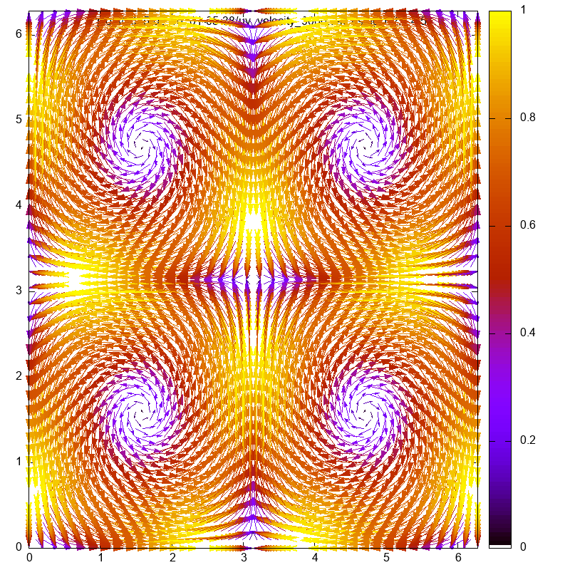
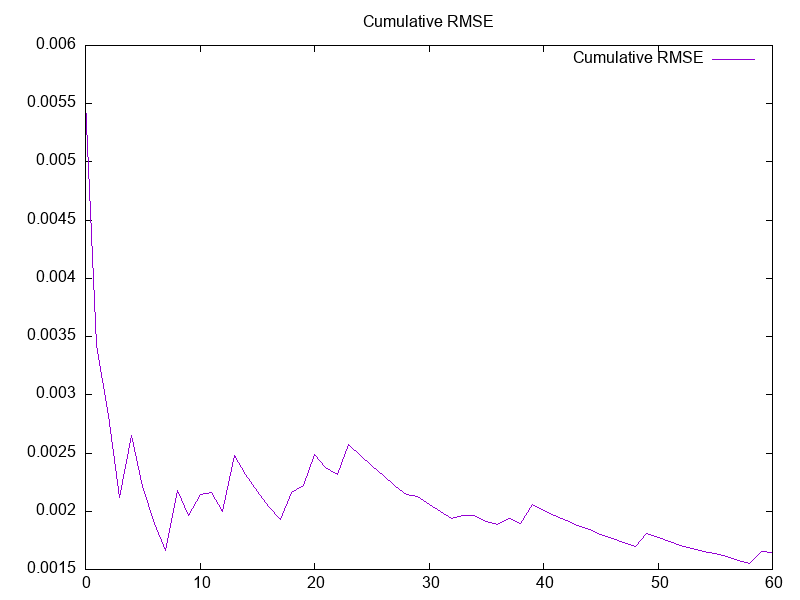
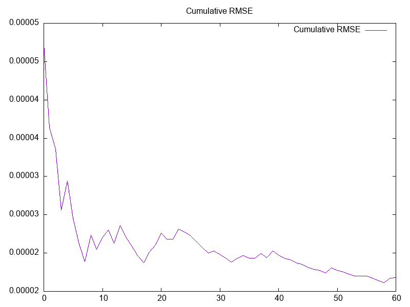

# Tailor Green Vortex Simulation
Development of a parallelized fluid simulation for the taylor green vortex with a periodic boundary.

GPU Simulation is done with a buffered simulation output, while CPU simulation is implemented with iterative output.

It's a University Project for GPU Computing class at TU Berlin
Public repo: https://github.com/Derk21/taylor-green-parallel-cfd

## Current state of simulation:
(gpu: explicit diffusion + pressure correction, advection methods are currently wrong)

<table>
  <tr>
    <th>Simulation (with mac cormack advection)</th>
    <th>Simulation (no advection)</th>
    <th>Analytical Solution</th>
  </tr>
  <tr>
    <td>
      
    </td>
    <td>
      
    </td>
    <td>
      
    </td>
  </tr>
  <tr>
    <td>
      
    </td>
    <td>
      
    </td>
  </tr>
</table>

note: simulation with advection is less accurate, probably because of low degree of interpolation
rmse: of mac

# Requirements
- cuda
- gnuplot-iostream-dev
- might need to add your cuda architecture to [CMakeLists.txt](CMakeLists.txt)

# Running the simulation
```
make main && ./bin/main
```
output: timestamped directory in plots/timestamp/ contains .dat and plotted png of every iteration, animated gif of simulation and an error plot.

adjust parameters like timestep, iterations, sparse/dense, maccormack etc. in [constants.cuh](bin/constants.cuh)

run tests like this:
```
make test_diffusion && ./bin/diffusion
```


## Features:
Diffusion:
- explicit

Advection:
- semi-lagrangian with bilinear interpolation 
- mac cormack (gpu and cpu implementations produce different results -> error)

Pressure Correction:
- with Dense CUDA-solver 
- with Sparse CUDA-solver (~5 times faster than dense) (only GPU)

### measurements
(explicit diffusion, maccormack advection, 60 steps):
- cpu simulation steps + gpu dense solver:  17.382s
- end2end gpu , dense solver (Buffsersize 20): 9.538s 
- end2end gpu, sparse cholesky solver (Buffersize 20): 1.999s

# Practices used from the course
- shared memory (used in divergence, interpolation and diffusion)
- coalescing (only in parts (divergence and interpolation use it partly in shared memory))
- biggest speedup came from implementation of sparse pressure correction (~5x faster)
- async Streams (independent Kernels in Mac Cormack Advection)
- optimization of launch configurations 
- double precision is essential for physics simulations 

# Issues
- advection looks wrong and gpu-cpu implementation of mac-cormack have different results
  - the interpolation is just bilinear, which might be to small degree for such a simulation (cubic / some spline    could be much more accurate)
  - gpu interpolation could be done partly with shared memory (if integrated velocity is inside tile)
- lacking coalsescing in global memory (velocity is stored in alternating u,v,u,v ... format instead of in double2)
- pressure correction test has some unresolved memory issue, but function calls it makes are tested to be correct (divergence, correction step, solvers)


# References
https://en.wikipedia.org/wiki/Taylor%E2%80%93Green_vortex

https://github.com/tum-pbs/PhiFlow/

https://tum-pbs.github.io/PhiFlow/examples/grids/Taylor_Green.html
